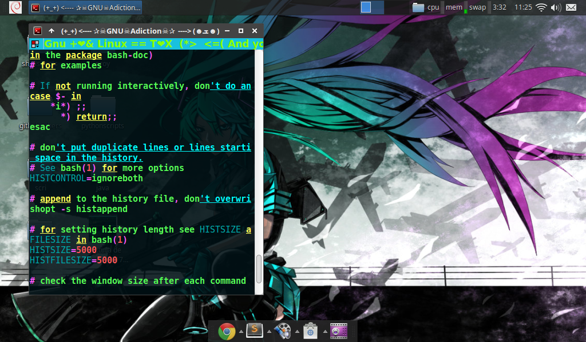

# (+_+) <----✰ ☠GNU☠Addiction☠✰ ----> (☻ܫ☻)

[](https://gitter.im/GNU-Addiction/Lobby?utm_source=badge&utm_medium=badge&utm_campaign=pr-badge&utm_content=badge)


---
### (∩▂∩)  [Here you can find my starred repos:](https://github.com/TitanHero) *(★╭╮★)**

[**Simplebashrc**](https://github.com/TitanHero/simplebashrc)
> My standar but useful, .bashrc config file, added with useful hints and explanations, and some little custom modifications to get more profit of your shell

[**Gnu-Linux-easy-format**](https://github.com/TitanHero/Gnu-Linux-easy-format)
> Shell script programmed with gui (graphical user interface) to configure, modify, revise and route dnsmasq, dnscrypt-proxy and resolv.conf. 

[**Sublime-execution**](https://github.com/TitanHero/sublime-execution)
> Sublime build and script that execute your shell script on terminal 

[**Sublime-execution-python**](https://github.com/TitanHero/Sublime-execution-python)
> Sublime build and script that execute your python script on terminal (it works only on gnu/linux) /\ Sublime build y script que ejecuta tu python script directamente en terminal(solo trbaja en gnu/… 

[**Dns-resolvercrypt**](https://github.com/TitanHero/Dns-resolvercrypt)
> Shell script programmed with gui (graphical user interface) to configure, modify, revise and route dnsmasq, dnscrypt-proxy and resolv.conf. 

[**Smile-theme**](https://github.com/TitanHero/Smile-theme)
> A theme for the terminal music player cmus 

[**hero_theme**](https://github.com/TitanHero/hero_theme)
> A theme for the terminal music player cmus 

[**Little Script**](https://github.com/TitanHero/LittleScript)
> A tool under development for do reverse engineering  using radare2 and your shell

[**Tasty Candy**](https://github.com/TitanHero/TastyCandy)
> A very cool and amazing theme for VisuaL Studio Code

[**The Fancy Retro Electro Tux**](https://github.com/TitanHero/TheFancyRetroElectroTUX)
> I always had soul of artist so I'm very efficient to desing and do front end or GUI, so all related to that goes here you know I love Gnu/Linux, and like me make things for it, it must have the better GUI of all, and with me, it haves...so in this repo goes all the new clothes for GnuLinux and derivate ...

[**Light macchanger**](https://github.com/TitanHero/lightMacChanger)
> A short script that I made to change your mac address without using *macchanger*, this is make with only system binaries.

[**Fancy GitHub Dark**](https://github.com/TitanHero/FancyGithubDark)
> A css scheme configuration, to add to GitHub a theme Dark, this theme  must to load with the dev tools of your browser, or you can install a app  to do this automatically.

[**Shelltrific**](https://github.com/TitanHero/Shelltrific)
> This repo contains all the themes that I made and I will make for *Terminator* terminal emulator (shell) by now there are 112 very cool themes, made with love, dedication, pasion, and nights without sleep, so because that, it's pure art, don't go to museum, only see the gif of my themes, is the same,even practicably is like if go to the Louvre museum,you know ....Mona Lisa...Picasso...Salvador Dali...Banksy...*ME*..#LoL techno art....GNU-Addiction...GNULinux.

[**easyTermux**](https://github.com/TitanHero/easyTermux)
> Do you use [Termux](https://github.com/termux/termux-app)??? If you answer is yes, you should visit this repo, because this repo help you to give steroids to your Termux app,b this script install some binaries necessaries to complement your Termux app, it configure a .bashrc file with 2 new prompts and some alias, also install a dircolors database to let your Termux powerful and beatiful, try it, it will like you I'm sure.


===============================================================
# My heros special place..

> Trinity(without she Neo never can stop the bullets)

> Neo

> Richard Stallman from 1975

> Nikola Tesla

> Elon Musk

> Dennis Ritchie

> Margaret Hamilton(also is my platonic love)

> Katie Bouman

> Peace && Love
 
================================================================
### List of persons that donate to a good cause
>


================================================================
### List of persons that plant a tree


=================================================================
### List of persons that adopt an dog

> Me, cool finally.


=================================================================


# BLOG (\*╭╮\*) (⊙_◎)...😉👍✌️

### 54902029032

> Above is my phone number....lol....joke.

First, sorry for don't upload some code lately, you know, I was coding a some lot, trying improvement my tricks, anyway, 2 days ago  I had the opportunity of eat some mushrooms, yeah of that kind that have it super powers, Yeah I drunk it, it was merge with Pulque....LoL.. I was trying find some answer to all, to my life, to the right now, time, who I'm, who I was, and who I want to be, you know, something that  I didn't see in all this time, and for be honest I didn't found anything, only words of encourage, Yeah, how, keep coding, Animus, be positive, smile, don't discourage,  keep coding, be optimist, Yeah, and this words was the mostly repeated it "Keep coding", Yeah was that words, and that I was doing, I don't know something in me says me and believe, that in a point if I keep coding and studying, in a future I could do cool things useful that help people, you know lately I thing that my code is shit, that it doesn't help and it's not useful, and maybe how said a person, I'm a bug, a fail, an error, only an issue, but looks like a little part of me doesn't think that, that part have faith in me, because that i have to do a lot of changes in my life, improvement, and keep coding, being positive by the moment is that the only  that I can do, and is the best that I can do,  I have to mature, I need to grow up, and keep coding....With a lot of desire and doing the best I can, I gonna have to be cooker again...yeah a coder cooker skater....lol anyway, so if anytime you feel like me, all that I wrote here is these I recommend do...only are a few of words but I really thing that could be useful for you....Keep coding, be positive, smile, don't discourage, animus, KEEP CODING...!!! in any moment all that effort be worth, Just search it.....

---

### What is your favorite OS???

> The brave and cool girls and boys use GnuLinux

What is your favorite OS???
...LoL, I finished of made this meme, don't take personally is just fun and a meme...lol


---

### The date

---

### Initramfs

> Love for anyone

Ok my pc were to hell, initramfs...mmm....shit, if I don't remember bad, initramfs help us to boot our system, yeah initramfs is a kind of little system that is loaded in ram and it test, configure and get up our system, also when something fails it let you repair or do the test manually, so yeah, when you boot your system and initramfs appears is because something were bad, and yeah right now I have my own initramfs, so due that I have only 2 options, repair my system or reinstall, I don't want lost my system I have a very lot of info and work, but also I don't want spend so much time in here, the thing is that the best is reinstall, my system already was hacked, yeah for a person, and the true is that I don't have problem with that, I think that I'm a good person that don't have anything to hide, I don't have money and the true is what if that person should asked me for a ssh session to my pc, I should give it without problem, if that person asked me something about my life I been answered all honestly, vuln my system never was necessary in first place, the bad is the action, anyway because that I think that the best is reinstall, all is contaminated with the past, is necessary start again from 0, forget all and forgive, in our lives many times is necessary that, forgive and forget, I think that I needed a lot forgive to this person, anything that pass in the past is there, don't in the present, the only that I want is that the people stop of hurt me and dissapoint me, I want to trust in the persons again, because that I gonna reinstall my system, and if that person wants a ssh connection I will give it, and not only to that person, to anyone that wants, is time for me of stop have fear to that people hurt me, because hurt me more don't have friends and be alone, I have to trust again so because that I gonna delete all my system and reinstall a new system with a ssh connection for anyone that wants....So animus, never give up, Peace && Love

---

### I love Tux

> I don't know the kernel panic in GnuLinux

Really I don't lie when I say that I don't know the kernel panic in GnuLinux, in all this years using GnuLinux I never had a kernel panic, cool, very very cool, kernel panic??? What is that...Anyway I let you a meme that I made, Why??? because I can and also because GnuLInuX isn't Unix, isn't Windows, isn't macOS, GnuLinux is amazing....So animus, never give up, and Peace && Love...


---

### Share and help

> Peace && Love

Jajajaja seeing YouTube I realized that exists a some of Linuxeros very radicals...LoL, I how Linuxero I was of that way long time ago, right now I'm more light, I love a very lot my lovely GnuLinux  and the Open Source of course but right now I don't see any purpose of be in that way, sometimes the Linux community could be very toxic and egotistical because they think that know more than others, I think that it's bad, for me GnuLinux and Open Source represent share and help  without expect nothing back, Yeah GnuLinux is the best representation of a Hippie ideology in the tech world, if this it would have been different, I would not be here writing this, because that ideology that handle GnuLinux and the Open Source was that made me fall in love of GnuLinux, so if GnuLinux is about share and help, why we all that use GnuLinux can't be and think of that way, you know GnuLinux and Open Source is about Peace && Love so let's give love to our community, don't be bad with that persons that don't know or want to know...Yeah I know...Read the fucking manual first, but you know, we need to be more tolerant and understanding, not everyone is born knowing, and being honest in my case I still need to learn a lot about GnuLinux and I still be only a begginer in this, but whenever when I see someone with a question I always try to help him with the little that I know, being honest, with me nobody ever helped me, but I think that is cool give these that you never had, and the best is that helping to others make more big and cool our community, I don't know...only think in this...share and help... that's GnuLinux and the Open Source 😉😁👍✌️


---

### Get animous

> No more regrets, there are people who are much worse than me ... I'm shitting with so little, it hurts but it's the truth, wise words of a relative ... Chale ... but it's true, something to think about...maybe she make me angry with that but is the true, I forget said that I love to she so much...never forget that again...animus

Do you believe in the spirit? yeah these that you and me have... a spirit, something that make us more stronger,  that essence which move us to go forward, and give us will, being honest me sometimes I believe in it, sometimes don't, is hard for me have faith, really, do you believe that exist a person that love us so much? Sometimes I wonder...So if he exist, why he take me off everything, I'm not a bad person, I deserve that? really I can say anything about that questions, you know, maybe I can't understand his true will, I know, maybe I'm being so dramatic, because, I have so much lucky, a lot of persons don't have the lucky that I have, I have love, I have life, to my family, and a oportunity of be better, the thing is that there is many things that hurt me a very lot, could had anything and then lose it, hurt me a lot can remember and that cost me a very lot recover all, mostly my mind, my being, but even of that way I can see light at the end of tunnel, so many times I think ....maybe the destiny had to be in that way, maybe that person that love us so, so much, want to prove a point with me, maybe he wants that I value all that he gave me, he want become me stronger, maybe he is preparing me to face off something bigger, and this is the way of do it, maybe he wants that I show to persons how many is my will of go forward and show them that can be doing, you know start in less of 0, maybe he wants that I start of give the best of me, because being honest, I had not given my best for a long time, you know ... maybe is that, maybe is nothing, really I can't confirm anything, is only my guess, but I like to see it in that way, is weird, you get used to just being, and you stop striving, you stop giving your best, to yourself and people, and I fell into that cycle, you know, I wanted to receive love from others, but without really giving it, how many times I had the opportunity to give love to the people around me, to tell them that I loved them, that they were the most important thing I have, and that I feel lucky that they were with me, and I did not do it, I was absorbed in my loneliness and my sadness I wanted to receive love without giving it and asking for it, it cost me so much, I was so proud, I did not usually thank those people who wanted to help me and helped me, I refused to accept that I am not so strong how as I said that I was, that I cannot alone and that I would never get anywhere alone, I wanted to be hugged, I used to hide that sadness that gave me to search for love in places where I would never find it, when the people who loved me were in front of me, I was so tired, I was selfish with my being, I was disgusted with myself, I think that I needed to lose, yes, you know, I needed to fall, I had become accustomed to having everything easy, I was not trying anymore, I was no longer doing my best, perhaps it is ironic, but when I had everything, I asked for tremendous adversities , in my case, against adversity is when I give my best, when I grow as a person, I become tremendously strong, I demonstrate my invincible and exemplary being, in the greatest adversities of my life is when I have the best successes of the same, and I asked for great adversity, I wanted so much to be better and I had little will to be, it is complex maybe you don't understand me, and for be honest, I don't understand either, It is strange but perhaps that person who loves us so much listened to me, and gave me tremendous adversity, and I came to think that it is too much, I come to feel that he is carrying me so hard, and I ask why? Why of this way? why so difficult? but being realistic, it could be worse, it's just that I despair, that I knew so much, I could do great things with technology, and I never did them, and now that I want to do them, costs me so much work, relearning, re-practicing, starting 0 again, and not even that, start from less of 0, because my mind got very tired in the 6 months, right now costs me so much work to focus and memorize, and I feel so much helplessness, because I was not like that, I learned everything at first without reviewing, and now not, now I am aware that if I want to at least recover my skills it will cost me a lot more work than before, for example I want to make a testing app for android, and I don't remember much about java anymore, I read syntax and I see methods, structures, classes, there are a lot of things that I don't remember, and I'm going to read documentation and that leaves me with more doubts than answers and I end up reading much more documentation, and at the end I don't get anything, anyway maybe in my last post I said that I gave up, and yes, maybe I harassed tumbre to surrender, since on my vacations I chose to give up, I decided not to go any further, I was so tired that I couldn't take it anymore, but I was forced to advance and just for that reason I am here, because I had no options, and I decided not to persevere in keeping everything what was good for me, I choose to let go of my dreams and aspirations, I decided to stop going against the grain, and I think that was the worst thing I could have done, because I became the type of person that I never expected to be, I became a loser, so looking back, I realize that I cannot give up, I will not give up, if I did, it would be useless for everything that happens to me, it means that I'm don't go on, that I didn't learn anything from life, that only I stepped back, perhaps this is the way in which I demonstrate my courage and indomitable will that I boasted so much of, going against the current again and against an even so much greater current, I can remember that in the past I never gave up, that's why I grew up as a person, facing adversity and moving forward, and maybe due that, if that person who loves us so much is there, took me it all off, to demonstrate how to set the tone, for this time really give my best, not to do the same mistakes of the past, because if I can, with a mind so but so worn out, you could do much better, I must be strong, you must be strong, after all my greatest quality never was my memory, that was just a small plus, my greatest quality was always that I didn't give up, and that's why I will not do it again, Zoro didn't when he fight with Mihawk in the first fight that they had, I will be like Zoro, well, if I can exhort you to something, with all this that I have lived, it would only be this, if you are a programmer, coder, pentester, graphic designer, etc, etc, anything that has to do with technology, value these that you know how to do, take advantage of what you have, you can do great things that can change to the world, you can do fun things that make people happy, you have super powers, value them it, so do not waste them, do not waste time, take advantage of your skills, improve them, do not wait to be like me to value, if you have people who are important in your life, tell them that you love them, show them how important they are for you, do not be hard with yourself, do not wait to receive love to give it, just give love to everyone and you will see that you will receive love, if you are just learning to program, already we are 2 lol ... just kidding, if you are just learning do not despair, Just be constant and everything will come, and finally ... Always give your best and never give up, don't be like me, you don't want to be like me, don't wait that the life take everything away from you to realize how much you worth and how much the people around you worth, tell them that you love them ... Be better for they, I encourage, yes... we can ... Peace && Love.

---

### Fucking tech

> True history

Recuerdan que siempre digo "Nunca te rindas", pues la verdad hoy me rindo, quisiera poder explicar todo de manera detallada, pero es mucho para contar, y ademas aunque  les contara nunca me creerian, en fin voy a resumir, hace 7 u 8 meses paso algo tremendo en mi vida algo que la arruino por complento, primero dejenme decirles y perpararlos, en esta vida no todo es color de rosa, existe gente egoista, soberbia y despota, que estara dispuesta a hacer cualquier cosa con tal de satisfacerse a ellos mismos, a ese tipo de personas no les importa nada ni nadie con tal de satisfacer sus deseos egoistas te van pisotear , solo piensan y viven para ellos, y para ser honesto este tipo de personas no hace mas que contaminar a la gente que esta a su alrededor, este tipo de personas, son una bomba de tiempo, que tarde o temprano explota y carga a todas las demas personas a su alrededor al infierno, en fin, hace 7 u 8 meses, yo estaba en una situacion emocional tremenda, tenia depresion, ansieda, baja autoestima, sentia una soledad muy grande y mi tristeza era mucha, entonces me toco conocer a esta persona, solo quiero decirles que se aprovecho de mi situacion emocional y de la noblesa que aun tenia en ese entonces, en fin, creo que una persona tan toxica y otra persona con tanto dano emocional no deberian convivir, esto por que a final de cuentas la persona toxica terminara consumiendo a la otra, en fin, todo esto que paso hace 7 u 8 meses tuvo como consecuencia mi viaje a la atlantida, les puedo decir que ese viaje fue una pesadilla dia tras dia que no acababa y aun hoy, no termina de acabar, todo esto es una pesadilla sin fin, a lo cual llego a la conclusion de rendirme, simplemente me rindo, mi vida se fue al carajo, sigo cargando con todo lo que paso hace tiempo, en mis vacaciones no hubo dia que no pensara, en abandonar la tecnologia por siempre, voy a explicar hace ya varios anos como 7,tuve que elegir dos caminos, aplicarme a trabajar donde trabajo o seguir mi tonto sueno, y elegi seguir mis suenos, y ende estoy aqui, muchas veces me arrepenti de haber elegido mis tontos suenos, por que estoy seguro que si hubiera decidido mi otro camino, no estaria aqui y seria muy feliz, con un buen trabajo, siendo prospero, con esposa e hijos, ustedes saben, teniendo todo lo que una persona podria desear, con lo cual llego a la conclusion que todo esto de la tecnologia no a hecho mas que hacerme dano, les voy a ser sincero de mi situacion actual, soy tremendamente fuerte ahora, pero sigo teniendo depresion, mi mente esta tremendamente fatigada por los 6 meses de vacaciones y me cuesta mucho estudiar y enfocarme(parece que mi mente no esta aqui), no entra mas informacion, en mis vacaciones me dieron un coco wash tan severo que hizo que se me olvidara gran parte de lo que sabia, mataron a mi nino interior, mis suenos, y todo lo bueno que habia en mi, debido a toda la carga emocional que tuve que soportar durante estos 7 u 8 meses, y mas que nada durante los 6, me cuesta mucho trabajo memorizar, perdi mi inteligencia y capacidades conigtivas, practicamente soy un envase vacio, no me siento comodo en mi casa ya que aparte de que me recuerda todo, muy probablemente esta persona siga teniendo conectada su mierda que invade mi privacidad, si en mi propia casa, asi de tripas esta esta persona, y aunque no la tuviera, la duda ahi esta, mi pc y mi smartphone estan infectados de malware, mis cuentas vulneradas y la verdad no queria formatear, primera por que tengo un resto de trabajo sin respaldo, segundo por que si respaldo, algun archivo tendra malware, tercero por que aunque formatie, probablemente cargo malware en el firmware de la pc, la pc es vieja, por lo tanto igual el bios, asi que seria facil explotar el bios, bueno al menos eso hubiera hecho yo para asegurar el acceso, puede que mi condicion de salud fisica este mal, muy muy mal, les estoy hablando de algo incurable y que me podria matar, la verdad me siento muy cansado mental y emocionalmente, en mis vacaciones de 6 meses al parecer me tronaron el tape, regreso de mis vacaciones y el mundo es un asco, esta muchisimo mas peor de como estaba antes, y lo peor, esque mi familia ya no quieren que use la pc, ni mi smartphone, si asi de jodido estoy, mi vida esta totalmente arruinada, la verdad quiero ser positivo, pero no puedo, necesito desconectarme, dejar todo atras pero ya cargo demasiado dano, miren la verdad yo ya perdone a todas esas personas que me hicieron dano, no tengo rencor ni resentimientos contra nadie, siendo sincero pienso que son unos idiotas, mas no les deseo ningun mal, en cambio, pido por que les valla muy bien en la vida, pero creo que esta vez sus estupideces de hackers de pelicula si se pasaron de la raya, creo que arruinarme mental, fisica y emocionalmente asta llegar a este punto fue demasiado, creo que siempre eh sido buena persona, de buen corazon que aunque con mis grandes defectos, nunca busque hacerle mal a nadie, siempre intente ayudar, por cual no me merecia esto, esto fue demasiado, creo que la vida es una hija de perra que es muy injusta pero la acepto, en fin ya no puedo ni quiero cargar mas mierda y estupideces, de gente mierda y estupida, por eso decido alejarme de la tecnologia por un tiempo, asta que entre la siguiente generacion, ya no quiero mas estupideces de hackers de peliculas,o personas obsesionadas conmigo, quiero mi privacidad de vuelta, quiero a mi nino interior de regreso, quiero volver a sentir esas ganas tremendas de salvar al planeta y ayudar a las personas, quiero estar bien de salud, quiero mi inteligencia conmigo, quiero volver a sonar, quiero olvidar toda esta mierda, y aunque me duela, el primer paso es mandar a la mierda todo..... todo lo que tenga que ver con tecnologia,ya que la tecnologia deberia ser divertida y genial, y por el momento no lo es para mi, solo es una carga, me retiro. En fin, no hay razon para compartir esto, deberia solo hacerlo y ya, pero los comparto para que se den cuenta de sus estupideces que hicieron, y el dano que hiceron, y haber si les cae el 20, y cambian, por que al final de cuentas esta vez yo pague los putos platos rotos, y los sigo pagando,  pero la siguiente, puedes ser tu, en fin animo y mucha suerte....Peace && Love

### Now I only think in improve my tricks...

> I haven't changed my underwear in 3 weeks....Lol...animus

Is strange, very stranger, I still adapting to the new kernel of my life, I see everything so different, I see myself so different, everything is so different, even, I see the news, everything that happened to the world while I was away and really I don't care, I am not interested, I see the pandemic, I see the manifestations, and even then I am not interested, it is not something I should worry about now, I had already worried about these things in my past, and nothing of What I would have done or change something, also my way of thinking about all this I had already shared, it would be too much to say something, I realized, that it is impossible to save the world, help others, when you do not even do it With yourself, first I have to help myself, in order to help others, let's be honest, you can't give what you don't have, and the world is not going to be fixed with just news and tweets, and if it's could so easy, we would live in the perfect world, I think that now it is more important recover my kernel modules, How would like me to go back to being like before, with all my skills and without defects, but at this point it is impossible, I am terrified to say it, but the damage is irreparable, now I only think about improving my tricks, so, fuck world , fuck everyone , if I do not repair myself, I cannot, nor could I repair anything else, so stuck in your ass the fear, stuck in the ass the protests and abuse of the authorities towards The protesters, You already know that we all must be good, behave well and help others, so don't do the opposite, today I just want to find myself, don't think about it too much, look at the sky and breathe, listen to that song that you love so much, you are alive, live, be happy, seek good for yourself by doing good to others, relax ...Your hair will fall someday, be it a man or a woman, donate it ...


### Incident report

> Traslate in english with google traslate enjoy...lol animus...

To be honest, the past weighs on me so much, tremendously, it is the bad thing of remember, as this song says "Short circuit during teleportation, head and body, each one on his side( https://youtu.be/CbBCariWQCs )" ... is so difficult to adapt to a reality all different, everything changed and my mind in another place, if I could give context to this, I would use a more exact analogy than using software, if seeing from the point that it is an OS (GnuLinux OS oh sure) my life, in short, my OS was loaded with too many processes that overloaded the cpu ... they made it slower and more insecure, until the GUI was laggard, since those processes consumed all the processing capacity, you know, the system already had too many zombie processes running, Useless processes that only did damage to the OS, many were created at the beginning when the system was turned on, which were no longer necessary for its operation, many had large bugs waiting to be exploited, and many others that had already been, and that by the way they were very heavy running, you know... obsolete previous versions, which would collapse sooner or later, they were already insecure and unnecessary, they had no purpose that only to be closed, they only consumed memory and processing, .. You know... processes that already should not continue running, the memory was contaminated, you know ... segmentation errors, in addition most of the basic programs for the correct operation of the OS, which should continue running no matter what happens, they were almost to have a run time error, the kernel panic was just around the corner, but this kernel panic was different, after this it would have been almost impossible to run the system again, it without saying that the processor was burning, this was going to end very wrong, so when the OS froze and stopped responding, before the OS got corrupted, the decision was made to disconnect it, (the decision was not mine they did it for me) but you have seen it many times, the system stops responding, and there is nothing else that can be done ... which is why you had to use the infalibe way used since ancient times, disconnect the pc ... LoL, at this point I went to study at foreign, I was disconnected, it was the only way to keep the system safe, and now that you turn the machine on again using another kernel (This is when I stop traveling to the Himalayas and return to my normal life) the system seems to start, yes ... at least I start, but with the initramfs which is the first thing that appears to me, I realize ... that something happened..you know..initramfs ... mmmm ... the first thing you do is throw a fsck command, to see if the system files are not corrupted, at that point I am now, running my own fsck, hoping that everything is fine ... that there are no errors in the OS, that everything is complete, but it seems what basic files were lost, things that were important, packages stopped working, important packages that satisfied dependencies of programs that were great and made the system coolest, but that ultimately were not necessary for the correct start, they were probably useless, I could not quantify how much is the loss of files, programs and configurations, but it is a lot, Anyway, ... what I learned with my bug report, is ... do not load your OS (Your life) with harmful processes, zombie processes are dangerous, kill them, leave them in oblivion, that your system does not load with they, you have to overcome them ... close cycles, if they fail and they can make the OS fail ... They will ... uninstall, kill the process, update your OS, to a higher version, you know, improved ... improved and without errors, if you can, update every day, do not neglect your system, it is important, take care of it, you must be checking it ... keep your OS light, relax, use the processing capacity for important things, system programs, which are necessary only for the proper functioning of it, Be prepared for eventualities some happen when you least expect it and for no apparent reason they will happen, you cannot avoid them, the best thing you can do is be prepared to respond in the best possible way, and not be stressed by them, since they will happen anyway. and you are prepared to respond in the best possible way, in the same way there are eventualities, some, rather the majority, can be avoided and prevented, if you pay attention to your system, if you analyze it well, and give maintenance, no once in a while ... every day ... learn everything about the system, knowing it well, will help you to be more efficient in it, it will be easier for you to find the faults and know where they come from, learn to using all the tools you have available, for administration tasks is a great help, keep your system light ... relax ... LoL had already said this, but just to make it clear ... let's continue .... install only light programs and coolest programs that improve the system or its use, only that and nothing else, do not waste your system resources with programs and processes that do not work ... uninstall ... the system is not only for work, you can also be distracted by it, install applications or games that distract you, be happy ... Anyway, there are so many things I would like to say, so many things, and so little time, I would be missing a life to say them, but summing this up ... take care, love yourselves, value what you have, enjoy life, be happy but with love, take advantage of your OS have fun, play distract ..... You know ... I repeat this to make precent ... I would like to tell you that the time I was off It was not easy, it was not easy, it was the hardest I have had to face in life, the mind gets tired and a lot, but in the same way it strengthens, I wish I could take a few days to land my ideas, the change, I still I'm adapting to the new kernel ... yesterday I was skating, it was not how I expected, wasn't how I image from Since 6 months ago, but it was what I needed, a little time just me and my dreams, however, getting to the point, life often does not give you what you want, it gives you what you really need, like this vacation 6 months ... Those long 6 months ... LoL ... no kidding ... it's a long time half a year...but it is ironic ... every day that passed I looked as if he would never see me again ... I was lost, and there was nothing I could do to avoid it, anyway ... if I had to judge by what happened, and caused the lack of half a year of lost history in my life, I can only say that it was too much, that for me it was not fair, but that unfortunately I needed those vacations to the space of half year ... (LoL .... laugh. ..value irony ... load that module in your kernel ... anyway) but I think maybe, it wasn't necessary that long ... time ... for me it wasn't fair, but unfortunately I needed it, maybe a little less time, anyway ... the interesting thing about the past is that it has already passed and you can do nothing to remedy it, you are forced to assimilate it, only that you can do with it, so if it does damage to you, just uninstall, remember ... forgive ... forgive you, forgive everyone,
Forgive everything, forget it these that damaged you, but don't forget what it teach you, only this way you can uninstall the past that hurts you, and in my case I think that the only thing that you can learn about the past is to be better ... animus, you can ... that's why I say that life does not give you what you want, rather what you need, and I needed to value, sometimes disconnecting the pc is the only way to close cycles, cycles of life , infinite loops, that were still running, endless processing, that affect performance, the integrity of the system, you know ... they only suck energy without stopping, (do not waste energy) only occupying and contaminating memory, paging ... These cycles are the worst, prevent them from running on your OS, and if they are already running, just close them, don't let that it become in zombie processes, your system does not load with them ... Remember, keep your system light, relax ... Anyway, skating I realize that the kernel module for skating still intact, in fact improved, my legs have become stronger, now there is more power for the pops, the tricks are more high, in short a kernel module that was improved, a program that now works more efficiently, I value it very much, remember ... value ... for which I am very grateful, I value what I have ... and although perhaps at the moment I do not have all the kernel modules that I want, I have what I need most ... which is to work with this module and application, see if through these I can recover elemental modules, work with the improved ones, and see if with this application I can save system files, unique files, broken files, that implemented improvements to the OS ... Well ... Just hold on to the best of you, to all the good, to everything that made you better, and in the meantime relax, enjoy every second, every moment, everything unique and unrepeatable running in that instant ... value it ... Peace && Love ... anyway ... this is the end of my incident report ... animus.


And as you can see this I wrote is a lot, but it had to be ... you know I had so many, but so much desire to write.


---

## Peace && Love

> maybe

In somewhere I read, that the Peace && Love are very important, do you can imagine a world where we all live happily? caring for each other, full of love ... Yes ... a perfect world, and only love is needed; something that everyone has, let's just try it, love.. and let's see what happens, let's let love move us, the peace && love, can you imagine it? and I say, chale, it would be so cool, such a world, it would be incredible, you know, everything would be perfect, we all would be happy ... LoL sorry, maybe this came out of nowhere, but I feel encouraged and with imagination, for the same reason I imagine that in some alternate universe, of the endless possible realities, there is a reality, with this same planet, with another same self, in which in that reality, people are governed by peace and love for others, that is, in some other alternate reality you and me live in the perfect reality, in the perfect world, the planet of Love and Peace, and the coolest thing, that on this planet and in this reality, it can also be of the perfect ones, of course, if we try, immediately starting with me, give love to others ...

---
## The destiny was wrote in binary code....

> mar jun  2 00:45:52 CDT 2020

Ok I'm back, so sorry for the last that I wrote in here, it was very stupid, so sorry to everyone....
The truth is I would like to apologize for everything, and to be able to justify everything, to be able to blame someone, there were tremendous reasons for everything I did and said, but the reality is that there are only responsibilities, and the responsibility is only mine, I no longer want to give explanations or remember the past, the past was left behind, the present ahead and the future with courage and strength, the only thing I want, I can, and I will say, is.. sorry, excuse me, I was very blind, I had everything that a person could wish, and I don't value it, I had to lose everything, to value everything, excuse me if I said or did something that offended you or made you feel bad, sorry, I lost everything, and now I will work hard to recover everything ... I have a ace under my sleeve, and it is that now I am really love, peace && love, I love myself, I love them all, oh and I no longer have depression, I have been clean for 6 months without tobacco, alcohol or marijuana, my mind is tremendously reinforced, clarified and focused, now I know what I really want, I have focus and discipline, I'm mature due that, I think I can be a simple, humble, invincible and exemplary person, noble and with a good heart ... we'll see us later ... I love you all...we will see us in the future...because my destiny was wrote in binary code...lol....
I love the music, One piece and GnuLinux....I wanted to say that for long half year....lol....super cool be free, all is very cool, the good and bad things of the life....I love can hear music, I love myself, I love you all, I love can see the sky, the stars, the city, even I love the past 6 months, beautiful you all, beautiful can use my old lap in this night, very cool can fight to recover my superPowers and make it better than before, fight to save the planet, I love can put effort  to jump 13 stairs of kickflip, I love can cover all my scares of the past with ink, I love be alive, I love can love, in less words I love anyting, I love my life, I love you all...I had long 6 months to create my master plan to reach my goals, how to be in top, how to save the planet, how to be a very cool person, how change my future, how to find to the love of my life, how to love so much to my family,my friends and me, How to be a trapeze artist at the Fuentes Gasca Brothers Circus, and all start with sleep early...lol joke, this is only a little part, but it start being better person that I was yesterday....loving more, smiling more, givin the best of me...being Z3r0-SeT.....lol..happy day...animus...Peace && Love you all....I must to sleep, but I want to hear music all the night, and dancing a lot......lol.....only for today, tomorrow I'm back to the discipline....lol...lol  but I'm very exited, you know, the future....is tremendous, due to this, I want to explain a little, when I meet to the girl more beautiful of this planet for second time(Abril the doctor) I made a master plan to be that very cool person that always idealize , that person that she deserve, but the true is that in a very lot of years I can' start with nothing, why???? Yeah for this reason, the first thing to do, to start acomplish my goals, always was let my all my addictions in first place, all that I did in this last years always was to the half because I never reach the first goal, so then of my first goal goes the next, the next is start to save lifes directly, literality save lifes, you know how a real SuperHero, so that start the next week, I gonna be volunteer to save lifes of anothers persons, you know the world can't be save with only beautiful words, that is the second goal, but for that I alway needed be clean...so yeah all the plans been in pause until I overcome my depression and addictions and I be a exemplary person and right now is the time......a big history is gonna starting, the real challenges start today and that's exciting... I gonna explain all this in the next posts....animus ...NevergiveUP, so I learned a lot of this experience, chaleeeee, I don't know, I keep bumping my head for what happened half year ago, I regret it so much, if I could have done things differently, I would have done it, I still have to put together a lot of things about me, about my life, just I gave other people the worst of me, I should have been better, I should have given them the best of me, my best version, I was so blind, I still can't accept that I lost everything, half year of my life, but I can promise that from now on they will only have the best, no matter what happens .... animus never give up....

---
## Adopt a new best friend
> Sat Sep 21 04:04:36 CDT 2019

I need adopt a pet(any) for me??? yeah me, the last dog adopted scape, the legends call that he is smoking crack under the bridges of New York and have a bitch #LoL, so would be cool adopt another dog this weekend, a better best friend new don't sounds very bad...let's try togeter ....

---
## How to save the planet

Really I don't know, I'm so lost like you, but I only know that it only can be do working togeter, but already I can see all more clear, I have to take a choice, even I'm more motivate and I working more the before, taking the risk of have a break point and have to abandon technology forever, even being a army of one,I can't handle this workload,I have almost 3 days wihout sleep only coding and that isn't enought, is a load of work very hard for me, simply I can't keep this up, even sharing my code for good actions isn't enough  and never will be, right now I have to go to my another job with 3 days wihout sleep, and even the prompt needs more work, the functions, the themes , the installer, god is imposible mantain this rhythm fuck, I have 7  months sleeping like 20 hours by week or less, I can't more mantain this way of life, simple bashrrc even need do the readme, the past week I said to my best friend that I can't more and he motivates me saying me that looks very cool be a army of one, bbut this never stop, also we all must put our grain of sand so I can't I give all that I have and is enought really I can't with this more, this due I'm wrong is responsability of all make a better plannet don't of only a few persons, this plannet only can be save if we all make our own part, so I stop this , I gonna take a long vacations of coding , also I don't gonna wok in imperial order or any repo mine now is your turn of prove of which you're made, you have my example of will, change the planet ever I cut with this, body can't resist more, anyway is your turn to prove your value, so bye until the next year
## Never give up

> dom sep  8 21:16:56 CDT 2019

Ok stop of so much drama, maybe this week I was more vulnerable and sentimental than others days, I'm always a very strong person but this week I losted to my best friend of all the galaxies of this universe, yeah because his girlfriend want to be the center all, and she think that I stole his attention, but what i can do?? Should be egoist of my part, don't let that have a family so I decided to get away, and although that hurt me a lot, I think it's the right thing, otherwise I would be acting just like his girlfriend, so that let me very vulnerable, but today then of meditate a some, and see in retrospect, I can see that I started to act like a child, and what if my repos yet don't have starts(that for me mean that them is unusefull), and what if all the persons say me that I'm wrong for do that I love, so let that all this affect me, and change my plans is only give up, and that isn't my style, I don't give up, so if I don't gonna stop doing which I like and that in I believe, I will not listen to the criticisms of others, and if my repos are shit for the others, then I will improve them more, so much more until the point that they are useful for people, I don't give up and that is what defines me, otherwise it would only be a faker, who speaks a lot but doesn't believe his own words, so you and me, never to give up, because work hard and will Indomitable move the planet and can change the world for the better, so let's do it.

---

## Faith Jump...

> jue sep  5 19:19:11 CDT 2019

Really today I had a lot of depress, I wanted to cry a lot, I feel that I don't have true a purpose in this planet, I feel that I'm here without a sense, when I say that GnuLinux and the OpenSource save my life and  gave me a purpose, I say seriously, without the OpenSource then of lost to Abril, I lost my main purpose, but I was still having the OpenSource, I don't have any for which I fight or live, in this fucking planet of shit, the persons are shit they are so egoist and materialist, couple? they are shit at least the past mines, and I feel repulsion to the love, and don't exist something material in this world that could make me happy, I don't have kids, so to my family I don't care so much that we say, still working in my repos is lost the time, so right now I feel me lost again, I feel me without purpose and I know that this is bad, and just make worst all, but I wanted to drink, drink a lot.. but then of sleep some I started to feel me better, ok just I needed sleep a little and a some of hard work to get back my animus, but really I don't like put price to my work with the pc, I feel that I betray myself and I don't want to work for money, I feel this day like when I had my break point, yeah I feel the vibe of like these dark days, I feel that I'm taking the same wrong way that before when I was the old LeX and I only wanted money, status, power, prove my value to everyone, show to my ex that she was wrong with me because she always treated me and made me feel like crap and second table plate, etc, etc, in less words everything vain that you can imagine, so I started to behave like the same people, who made me be like that, yes .... like crap, and I had my break point, and fortunately the life, started to hit me a lot, a very, very, very lot, even being in the floor, the life don't stopped of kick me, again and again, until don't let anything of that person, yeah the life put in my place, and made me mature, forgive, and return to being the person I was before I became the garbage, needless to say, I did not succeed and everything went to hell, and that was fine, because I would not have known how to handle success, and I did not deserve to succeed, because for me such a person as I was, does not deserve succeed, and right now I know that I don't need nothing of that to be happy, because I was that person due the bad persons broken to that good person that I was so much time before, but I forgive and heal my wounds, so fuck, fuck, fuck, fuck, so I don't want that these happen again, I know that I am another different person, and that maybe now I deserve to succeed, but in the same way I am afraid of success and not being able to handle it, and go through the same thing again,so I think that I need to put me a goal, to do this digestible, and I know what is, I need something so big, that have so many worth for me, to face my fears, and demons,so that is be the prince that is mentioned in this song in the end https://www.youtube.com/watch?v=XjAkGaGF9zs, yeah, go to parties, date and having sex with a lot of very sexy and beatiful girls(with protection obiusly), without anyone to say me something bad about that, you know living a very cool life, and then when I boring of that, find a girl friend with I could do true my pipe dream of be porn actor, yeah do the best porn video of this planet with masks (LoL i need to show you all how must be do this, like the best porn actor of this planet), and with mask because I want to be a politic and I don't think that my voters take it very well, or maybe yes, but I do not want to take a risk, although some of they could recognize me for my big packet, anyway they could not prove anything until I left naked without a mask,but rumors would run, but it would only be rumors, and yeah upload that very cool porn video to xvideos, and then maybe another without my mask to take the credit for all(only then on be politic and impliment new laws to make better my country and huge with so much love to Gnulinux and OpenSource in the goverment and in the schools) I know that this is very crazy, because I hate the couples, the love, and all that, also I have a lot of fear to succed and that she break me again how before, (and why simply I just contract to a porn actress??? Do you know much a porn actress of amateur level  charges??? I already though that so much time ago and is very expensive, with that money I can help to a lot of people) but "La vida es un riesgo karnal", so for acomplish my more crazy dream I think that worth do a faith jump, and face my more deeper demons...so let's try 😉👍

---

## Stop of this, no more that person again...

> mié sep  4 01:25:07 CDT 2019

Ok today isn't the day that return the old LeX, that egocentric,and so arrogance, person that loads a lot of resentment,because he still load the damage that make to him that persons, like him can't cure their wounds and locked in their paint only want a way to share their damage thinking that it is divide, but this kind of pain can only multiply, so that LeX need to go away and never come back, due he load so much pain that finally destroy you when you mind a heart can't manage the so big levels of that toxic and lacerated mind and heart, that is cause by a life fulled of persons that try to make your wealds more big, because their insecuritys, and intern feelings bad regulate makes that you can feel that darkness that they have because you don't have.... so the old LeX almost take the control of all and do a stupidity, like share that post with jokes where so much could are or be taken like hurtful, sorry really sorry, I started to loose the control, due the cool lex still be opaque by all the darkness, insecurity and damage that himself sometimes carry by let that the memories of dark times start to damage to his soul and spirit, when that fear and damage take the control of his peace and heart, that already forgive all, because is bad carry with that bad feelings and memories that only put fear, insecurity, and ego in his heart, he almost do one of errors more serius of his life, starting to let that the superficial emotions could decide the next action, yeah almost make a post very toxic, but he already isn't of that way he already forgive, but looks like still having some demons that still break to the cool lex, letting that their damage LeX takes the control, but lex promised never be that person again, so when the damaged LeX put to sleep to the cool lex, because lex didn't control all that feelings found, damage LeX could takes the full control of a lex fulled of fear, but not complety sleep, he was trying take a little of control over the actions of old LeX he don't wanted hurt to anyone, he don't wanted be like the persons that turned old LeX into what is, he didn't want to be victim to victimizer, and wasn't,because my  jokes never are and will never gonna be to make feel bad to someone,it's to make happy to someone and make him smile, make happy to the people, also is bad say that the creation of someone more is ugly or horrible, this is very wrong, due the work or anything that you made puts heart or love in it, never gonna be ugly, sorry, I really don't could use the correct words, that I thought,I tried to say that it could be so much better, if you put efford and hard work,so a part of me don't wanted to share the post and finally that part win and locked to the old LeX in oblivion, and hopefully forever, so I want to ask if you all do forgive me if ever I make you a damage, that person is the person that once I was, sorry that person isn't me, and is not the person I want to be.....

---

## Night of work

> dom jul 14 03:08:55 CDT 2019

Night of work? already I worked 16 hours in my another job,  I must to stop, but yet I have energy, to work more in my projects,  and  don't... don't is drugs, energy drinks or alcohol, is only my desire to get ahead and be better, I need to prove to myself, that all in that I believe don't are foolish dreams or a way to think very away of the reality, is simple, always I thought and think, that nothing is impossible in this world, your indomitable will with hard work can become the impossible to possible, yeah.. lately almost lost my faith, my will, but is normal,just see this world, all the injustice, pain, and no one cares,this looks like a nightmare, the panorama seems very bleak, without hope, but it is silly to see it like that, since you are hope, I am hope, everyone in this world is hope, we should only have faith in ourselves and others and work for it, because there will always come better times, as long as we do not lose faith and desire to make this planet better, so I fall a lot, is amazing, if I get a euro for every time that I fall, I would exchange them for the currency of my country, and I will be very poor because I am very bad for finances, but is sure that I would have gained more euros than anyone on this planet, so I fail and fall more than everyone in this world, but every time I've fallen, always I got up, and better than before, so maybe I will need a million of falls to accomplish my dreams even 1000 million more, but is sure that I got up and I'll keep doing it, because I never give up, that is one of my SuperPowers so you too have SuperPowers, so never give up, because if I can also you can, if I don't can is only because I give up😉😁

---


## Repo lately updated with a lot of art abstract

> jue may 30 20:54:29 CDT 2019

*You know, the tech help us to share in a way more complete the abstrac, you know, the computation is a concept incredible abstract, due it in really doesn't exist in this plane, is simply intangibly, the software is only a idea stored like 0's and 1's stored like electricity , and even like that, don't occupying space, don't is... don't exist, it does not exist in a certain way but at the same time yes,so due that if something so illogical and logical can works, techno art also  .....Even me can't understand what I said..anyway*


### This is art admire it...
 
> Joke, but already that repo have cool themes, for terminator, maybe it help you to animate your terminal, so you can clone, anyway I hope that it like you... 
### 😉👍✌️ 

[**Shelltrific**](https://github.com/TitanHero/Shelltrific)


---
## My themes for Terminator

*True History, true art*
> vie may 10 11:35:14 CDT 2019


**With technology you can do it all, remember this quote, How I'm a pirate with range of captain I told why not I make art style *Banksy* .....I do it Making art with the technology htop and my themes that are specially designed to looks very cool and with htop, this piece of art I builded  with a some of inspiration and with all that I have close to my hand, a little taste of my themes(you can install it try it all) of a collage full color and live, why the computation must to be boring or monochromatic, the life is full of colors, so?  my shells(Terminals) also is fulfilled of live and colors, also it let can read better the data**

### This is art admire it...

Its name is ......Colortop...LoL


**ColorTop**


---
#  (\*╭╮\*)   Challenge yourself   (⊙_◎) 

### Here goes my litle wall of challenges...Do you want more info about this?
### Visit this repository there you find all you need to know....

[**Challenge_yourself**](https://github.com/TitanHero/challenge_yourself)
  > Text format to help you complement my concept initiative of challenge yourself 
---

```    
{{{{{{{{{{{{{{{{{{{{{{{{{{{{{{{{{{{{{{{{{{{{{{{{{{{{{{{{{{{{{{{{{{{{{{{{{{
### 0000000000000000000000000000000000000000000000000000000000000000000000>>
]]]]]]]]]]]]]]]]]]]]]]]]]]]]]]]]]]]]]]]]]]]]]]]]]]]]]]]]]]]]]]]]]]]]]]]]]]

###                 o<+<>-****^**~*-^-**~**~**->x 
###                (   Finish your challenge    ]
###                 +<+>-****^**~*-^-**-*~*~**->o 

  ___ _         _ _                      
 / __| |_  __ _| | |___ _ _  __ _ ___ ___
| (__| ' \/ _` | | / -_) ' \/ _` / -_|_-<
 \___|_||_\__,_|_|_\___|_||_\__, \___/__/
                            |___/        

|_ _|/ _|  _  _ ___ _  _  | |_ _ _ _  _     _  _ ___ _  _   __ __ _ _ _  
 | ||  _| | || / _ \ || | |  _| '_| || |_  | || / _ \ || | / _/ _` | ' \ 
|___|_|    \_, \___/\_,_|  \__|_|  \_, ( )  \_, \___/\_,_| \__\__,_|_||_|
           |__/                    |__/|/   |__/                         

..........................................................................
>>>>>>>>>>>>>>>>>>>>>>>>>>>>>>>>>>>>>>>>>>>>>>>>>>>>>>>>>>>>>>>>>>>>>>>>>>
++++++++++++++++++++++++++++++++++++++++++++++++++++++++++++++++++++++++++


                   <----✰ ☠GNU☠Addiction☠✰ ----> 
                             
+-+-+-+-+-+-+-+-+             
      *********                  -+-+--+-
(+_+) Challenge |=-> [ Number ]-#{ 0002 }#->   
      *********                  -+-+--+-
+-+-+-+-+-+-+-+-+     
^
      +-+-+-+-+**+-+-**+-+-+-+**#\**++-+-+-+-++**+-+-++*+-+
     )>>[ DATE }->   mar   feb  5    19:08:38      2019  <<(
      +-+-+-+-+**+-+-**+-+-+-+**#\**++-+-+-+-++**+-+-++*+-+ 

+-+-+-+-+-+-+-+  -          o<+<>-*****^**~*-^-****~**->x -    ++++       *+-+-+-x
|C|o|m|m|i|t|s|  -x--x = >  o  To finish your challenge x -> {[ 20 ]} --o => 001 |
+-+-+-+-+-+-+-+  -          o<+<>-*****^**~*-^-****~**->x -    ++++       *+-+-+-x


^                                                            
+-+-+-+-+  +-+-+-+-+-++-+  +<+>-*****^**~*-^-**-*~*~**->o -    ++++       -+-+-+-+
T|o|D|o|\\\|T|a|s|K|s  +>  +  To finish your challenge  o -> {[ 07 ]} --x => 00  | 
+-+-+-+-+  +-+-+-+-+-++-+  +<+>-*****^**~*-^-**-*~*~**->o -    ++++       -+-+-+-+


^
+-+-+-+-+-+-+-+-+           o<+<>-****^**~*-^-**~**~**->x  -    ++++       **+-+-+-                          
|O|p|t|i|o|n|a|l| <-+* \-> (  To finish your challenge   ] -> {[ 00 ]} --& => 00  |
+-+-+-+-+-+-+-+-+           +<+>-****^**~*-^-**-*~*~**->o  -    ++++       -+-+-+**                           


<<<============================================================================================>>>

###                     __            
###                    / /  ___  ___ _
###                   / /__/ _ \/ _ `/
###                  /____/\___/\_, / 
###                            /___/  
###                            
###                  >>>>>>>>>>>>>>>>>>:::::::::::


       *********                  -+-+--+-
###       
##  (-‿◕)  COMMIT |=-> [ Number ]-}#-> 001
###
       *********                  -+-+--+-

commit 6987491ebd748b148c8c08992eeabb33418ed0c8 (HEAD -> master, origin/master, 
origin/HEAD)
Author: TitanHero  
Date:   Tue Feb 5 20:55:53 2019 -0600 

    Added the archive


```
--- 
## Exellence
*True history,true you...I hope*
> sáb may 18 14:56:46 CDT 2019

*Be efficient to improvement your exellence, simply ....*

https://www.shellcheck.net/

*A very cool tool to test if a least the
... code ....works??? you know...in your machine works?the true is that always work??? in your machine, Rather is the only  machine in which it works...So, be cool, Be efficient,be profesional, take courage, take a breath and see if that try of bug in reality works...I know..I understand you what that chunk code I mean; future headache, that future headache responsible of all your future massive migraines, and you tragic burst of yours hemorrhoids, and direct responsible for the first and the next 300, 500 bugs, rather saved mostly or all project bugs comes out of there,I know still being unfortunate what that chunk of code, never it will see the oportunity of become itself in thousand of failures(bugs),that is so sad, is so horrible, so good for now For you or your future, your future is pretty rude  is\\\\ the reality, but is so much better that if it only works in your machine, so, be mature and if you need accept that you need rewrite all the code from  the begining again maybe is the right and the best option, is you unfucking the things, don't desist  try,again and again  you need Read the fucking manual first many more,  you need Read the fucking manual first but in reverse,so anyway could be hard choose the right, but is the correct,is the right, and many times do right is very, very hard, but  tha choices are that define you, and yeah, is always do correct the more hard path ? Yes but it worth, is the best, is the fair,is you defeating yourself again, defeat yourself; and overcome all the best version of that person that you  were ever here that yesterday give more of you....... give more dreams , indmitable will,  Smiles... Fait, Qualities and habilites, all that you have even if that is almost nothing give be the best of you, defeat yourSelf , and upgrade you to you best version of all the times of that time in that exac moment...be weird, be strange, be unsense, be simply, be unique be only you, specially the best of you....*

---


# The perfec night
*True history*
> sáb may  4 04:44:14 CDT 2019

*This night is a very perfect night, is very cool, it have all the qualities necessaries to be a epic night working  in all that you love, its a quite and very peaceful night, this remember me  to Abril, in my starts in tech I started by study to all hours, always I  alone, there, was very lonely nights,the really I was very tired a surpass me of all I need ed to study and all that I know it, I was so tired of study every, every night without rest, without anyone to that give animus, trust in me, or support me, and all looks like it don't had end, it was I alone vs world, nobody took me seriously (I even think that even now they still do not take me seriously, but they already believe in me), nobody believed in me, and I do not blame them, after being me as I was before, it was impossible to believe, that Really, there were many nights that the truth saw me overwhelmed and frustrated by everything I had and had to learn, frustrated me, demotivated and made me want to throw in the towel, but always on those nights, every time I had those feelings, I thought about April, about what I could be doing at night, probably studying hard and saving lives, improving her own version of herself, and me? crying, like a small child because I had a long and long way to go by myself and maybe for me it seemed unfair, what a great contrast of situations you do not believe? because that same comparison brought me back to earth, to the reality, if I minimally wanted to offer the same thing that she offered me at a personal level, I had to exforsarme much more than normal and apply as much or more than she did and I kept doing it, because if it was not I was not at the level I did not deserve it ... and apparently the night became more enjoyable .... tonight I have the same aura and the same guy, the night is perfect, you just have to take advantage of it*


---


# Time to improvement 😉
### (My unemployed time)
*True history*
> vie may  3 15:14:25 CDT 2019

**I have shame of only say it, sorry  a lot for me and all this free time, This week and half was breathtaking amazing,I could did a lot of things, don't feel that constant pressure  by the hour  of day and be slave of time that you can't get, these outflow of that feeling, gave me a punch with a lot of punch of new, fresh, and cool betters vibes and new cool ideas that relax me, makes me happy, clean and relax my presence, cool days making all that I wanted or dreamed in that exactly moment,
doing anything that choose my desire  even if it does not make sense, but this time the one who decided was me, and I was doing what I wanted, yeah this last week and half changed me, and change me, and changed me not a  few, it changed my way of thinking, changes my way of be, changed my will, changed how I doesn't to must see the life, changed the way of how I perceive and I going assimilating the reality(rather I mean my own reality remember all is relative),  the planet , to the persons, all these adding a lot of peace and relax, inprovement and make betters my spirit, so anyway here we are, right here, right now, and is nathing more that only a shame that this ends, YeAh alreday I get job ..... again... Yeah this day is the end of that week and half,due tomorrow I start work......again #LoL, so if I could give you an advice, and  rather I gonna give it you......#BeHappy Break schemes and concepts, reinvent yourself all the times until you know who you are, while you don't  hurt to someone or be unfair with the others, try to find your happines and do what you liked, do the necesarie to smile, and relax you,  the time still runnig so take aproach of it, making that you love.....**

**`export #SMILE=$(#Peace && #Love)`**

---

## My night with the cool people in tech and the programmers...
*True history*
> jue mar 21 22:04:41 CST 2019

**Yesterday I have the fortune of meet and talk, with very smart people, those people of the kind amazing, very cool and very interesting, yesterday was a day that always I  gonna remember, all was very strange and unusual, but I could was talk face to face, for second time in my life, with the programmers, this was very new for me, because in whole my life only one time before, I had the chance the  talk with a programmer and it just only was like for 20 minutes, and even it worthed a lot, so yesterday I can talk of any, and all that I love, and be myself, but with they don't have any problem that don't understand me or can't understand me, or that they ignoring me, they love the same that I does,so that night a meet more people or rather was the first time that I meet to the people in tech and the programmers, all they are very amazing,but I wanted so much to meet  with the programmers,and maybe I gave a little more importance to the programmers, but I never had know them face to face well, this kind of people, they are the more closer to the code in tech, the most real to me, the thought guys and girls, and I just can't stop of thinking which was their favorite programming language, so what? I just made the question to every that I meet that day, why? I just want to know it, nothing better for me, for know you, that knowing, which language you like to code and why, and is amazing they have their own their personal and  different reasons of which language and why, even if a many of them have the same language, all they are unique and different(but not of type Harley Quinn...😆LoL), so the ideas of every one have  its own shining, what type of unique persons, so originals and so similar, so I could knew it that maybe, with they always was my place, I really wanted to hear them and know them, they are so cool, so unique, so brilliant, so friendly, so different of the programmers that always show me the internet,and with many  lot types of super powers, so the true programmers was there and not where always I tried find them, so I was feel so very sad because Twitter and  Facebook always was giving me,  their own versions of the programmers, and this cool programmers don't use these social media, it was obvious, so I thought that here is where I should am from the beginning, so I just wanted in that moment could have more time to talk with they, I liked me a lot hear them, so I say why not, let's try to give me another chance and see if here I can fit, also was very funny when I meet with they, I were very tire in mode legend legendary,  and very necglence very dirty, maybe when they saw me, they thought that I was a indigent, I was came there almost droping the towel, but I want to meet and  know more persons like they, more persons very cool and amazing, I hope could see them again very soon, and could show them to the true good LeX, so this is all, this was my night of yesterday, my night with the cool people in tech and the programmers, it was very, amazing, interesting, and funnies, something that I never can see here, and from here, where I'm right now, so probably yesterday was one of the better nights in whole my life, I never could forget these🤩😆👍✌️😁😆😄😎😁😆✌️😁🤩**


---

## (∩▂∩)  My goal  of this year ... (★╭╮★) 

### It is that my contribution stats become totally green (my favorite color, the color of life) instead of empty and abandoned to their fate .... (⊙_◎) (⊙_◎)


###  You can do it

These last months and maybe year (since always lol), I
leaved my github and gitlab abandoned,maybe was
the path that the life supposed that I had to travel,
really I don't know, but I know that life is a difficult and a
long way, and if you neglect, you can leave behind many 
important things, I forgot what makes me happy, and I 
concentrated on what makes me sad, the good thing is that 
nothing is absolute, and a simple idea, a simple thought 
can change the world and to yourself, you can can change the planet,
so keep in mind what do you want, work for it, never give up, 
and continue with a smile,there are the tools that the life gave you 
to overcome everything that makes you unhappy, that is the scheme of the indomitable 
will, you can lose many important and elementary things 
of you in the road of your life, and it isn't your fault, it 
usually happens and it will continue happening, what will always be 
your fault is if you not to look back and return for those 
parts of you, so full of color and happiness, maybe you 
can't be the same person anymore, since there are 
irreparable parts and some others that you will never 
find , but you have the option to create and replace those 
parts for a lot better, so go ahead and be the best version 
of you that ever existed, you can if you try, so go 
ahead and be happy, and fill the planet with bugs and strange 
code that nobody can read, as long as there are people 
who don't give up, there will always be a option to a future full of 
hope and better times, in which, you can and will be 
happier ... # NeverGiveUP #BeHappy #Smile .....

---
# Who am I? Why I'm here? And Why I'm tremendously pirate?

**Pirate is how in my country you do a refence to a weird person of the kind unique, practically insane (Just a little bit, you know the normal, I think, that all the people of this world we are pirates of the same ship, just that sometimes you take the place of a simple pirate marine, and sometimes you do a mutiny and takes the place of the captain of the ship, so what only varies is the rank and gerarchy in the crew, but never stops of change, in my case it is just, that I've been a little bit more time being part of the captains...)**

So I think to explain you better and give it a some of context to the before 3 questions, I have to tell you a tale(a true history, but tale sounds more of the movie lol), If I have to name this history, it would be .....

## The time I met the most beautiful girl in the world for the second time...True History ...lol

 I'm going to explain how it goes, several years ago, my life was in a tailspin, I was at a point in my life, where I wasn't going anywhere and I just sank deeper into the abyss, I had a lot of depresion, I was a junkie without future, that wasn't work or study, I was disgusting wasting my life, I was wasting my time, anyway, I went to a trip with a friend to the border of my country,He was the same like me, so you can imagine how we were, he use glasses because he's mega blind, a lot more than me, So when we came back, we take the amazing and magnificent idea of drink alcohol, for my that was great, I was not driving, but my friend yes, add to it that he wasn't have his glasses and was of night, so we came drunk and in a horrible road(like the face of freddy cruder), what could happen? Yes, we almost crashed and died and don't once(please already told you I already told you about the suicidal state in which we were going) it was three times with trailers(only trairles??? yeah my friend know the best ways to don't survive in a crash) of front(looks like my friend don't knew how rebase in a road with only two senses),so I really see the dead, but you know that scare me a lot but like I was a lot drunk I accepted my destiny, without regretting anything, but I put my seatbelt, just in case there is the slightest chance of surviving a direct front crash with a trailer (being optimistic cost me nothing), so by lucky we finally arrived and we had the ocurrence of celebrate(You know, we return alive), so we started drinking a lot of alcohol, and a friend who received us gave us a box of pills, according to that it was similar to clonazepam, but the truth is, that it was another type of pills (I'm not going to tell you the name ok yes carbamazepina) that we don't knew, but at begin the pill wasn't making us efect anyway we still drink them with alcohol,just we take more pills maybe their efect wasn't so strong so that was the solution, yeah taking more but not a pill or two, even three, like 10 or a little more each one of us, since they did not work for us at first, the thing is that the effect of these pills was very different, it dozed off the body,but mentally they did not do anything to you, now imagine with ten and accompanied with alcohol,they hit us very strong ten minutes before,to the point that we can't not walk, I was sitting on the floor and even I couldn't stand up a little, our body did not respond, and my friend is curulent and very tall , so when he wanted to stand up one of his legs did not respond and he fell exactly on my shoulder which for my bad luck I was supporting me in the floor with my extended arm, so was dislocated my elbow, yes, my arm looked horrible, very, very horrible, so to make this worst our friend who gave us the pills was very scared because he though that we will blamed him if came the police or the ambulance, also he didn't had the balls to help me to accommodate my arm, so he left us alone, even with the detail of and we could not walk, and due this was in the afternoon we was alone without no one to can help us, the worst is that we tried to talk to an ambulance, but for our surprise we are so sedate, that we could talk well, the language that we had sounds so sleepy, because we could not speak well, the big level of sedation which we have, slept us to the tongue, lol this is comic because we sounds very funny, but the red cross hung up all our calls thinking they were joke calls, they thought it was a joke, what else we could do? rather what else I could do?? simply, so I had to adjust my arm by myself, and it was so much painful of a level so big that even the fucking sedation don't work for nothing,so when I achieved that,it cause me that I was have a mega-pale,so seen this in this retrospec what would have happened if the accident could be of something more serious? so hours after I went to the red cross, my arm was not plastered, only bandages, some time before like a week (5 days) past, and a friend lends me a motorcycle of kind cross (they are for dirt, not pavement), and me for going around bragging and giving me of be very pro, I accelerated to max vel,  but there was gravel in a part of the pavement, so I tried to skid , but due to my speed and the lack of grip on the pavement by the gravel, I lost control, and the bike go out flying and spinning, I'm counting and you can imagine, it went flying that was in the city, in a street very fluid, so I was lucky because the bike didn't hurts to anyone,but so to save me,  I reached to jump but when I fell to the ground I supported with my dislocated arm, what happened? it turned to dislocate.......again..lol, or god, green cross was this time, the cool is that they plastered me the arm, a few days later I went to the beach(Yeah, with my arm plastered),So for my not fortune, unfortunately I had a problem in my throat, and being in the beach, so was very difficult get medical care,it was my worst trip to the beach that I ever were , so here the problem was that in there, aren't medical centers in the beach like in the city, and because the problem got complicated (I was need surgery yes or yes) I had to wait until we got back to the city, in that point the problem was so complicated, due to the lack of operation and the wear and tear because I could not eat or drink water,I arrived at the hospital in agony, with my arm in a cast, they operated me almost at the same time that I came, because I was almost to die, if it had taken longer one day I would have died, anyway, I was a disaster,that was a disaster, so many say  Every cloud has a silver lining (I do not know, your judge) but that same day I met the girl most pretty in the world for the second time and was the one that saved my life and motivated me be what I am now ... this part we will leave for another day nahh, ok when I was in in the hospital At midnight, yeah let me explain you because we came very late in the night, in the hospital wasn't any doctor, yeah no one, but due to my state I was need urgently cirugy for can save my life because I was at border of die, so they(the nurses) had to talk to the doctor specialist so they called and wake up and get out of bed

So then Doctor arrived urgently,and the doctor must to start to check me, so when I saw the doctor,for me surprice was a girl,so in that moment, I let in shock because she looks to me the more prettiest girl in the world, she had a few years old than me, anyway she left me dazzled, and I felt a lot of shame and angryness, since  my life was disgusting, my appearance was so neglected, and all that doing to avoid that it happen was took choices autodestructives (you can imagine how looked the picture of that moment), so I imagined even that could be her friend was imposible for me, she being a doctor and me a simple nobody without a future, trade, or benefit, anyway, so when she spoke to me I felt that I knew her of all the life, and that she was the love of my life, but for was clear and is obvious that a girl so smart,prettier, dedicated, would never take me into account, I was just less that the shadow of a simple guy, I was nothing, So finally she operated me, and she saved my life, so I had to pass  7 days hospital, she was doing his specialty so she came to check my weal every day with the doctors to cure the wound of the operation,also the doctors were super young guys, I could not believe it when comparing myself with them, in fact I could saw the look of a girl doctor when she shaved me and see my face, was a look like "What a waste of a man", finally on the third day, I reached the conclusion, that she was more than a simple doctor for me, we were related (maybe in another life), I pass a lot of hours trying to know or remember why I felt that I already met she,until my memory remember, as 5 years before, was operated a member of my family, and I had to be the one to sign their responses, and there was a doctor who was the one who give you the papers of responsive also took of return the papers , so whe was my turn and I saw to that doctor, was a girl, she became the most pretty girl in the world, yeah she let in shock, but I wasn' in conditions to try to get more words of the necesaries to make the task of the papers of responsive, also I was a little drugged, so my condition in that moment wasn't the apropiated to try my look with she, but I thought, "I'm going to put my batteries, I'm going to improve and defeat my depressionot , I'm going to study, and when I be a better person (better version of me) I gonna return to here with she and when I see she again I gonna invite to she to get out to a date, yeah that was me some years beforo but looks like apparently I forget that promise, since the this second time I saw she I was even a lot worse than before, a very lot, so that look to the past and very big fail of me make feel a very lot disappointment of me and my promise that really I never acomplish,so all that feelings founds in me in that moment makes born a new version of me, that day born a new person yeah me, in less words the cool version of LeX...cool


 so even though I had wasted a lot of my life, and it seemed like a foolish dream, I promised myself  never break a promise again,(and I compliment) and be the definitive version of me, the perfect man, and when I was two years in college I would go back and invite her to go out, but I had to be even more perfect than perfect, since I had a lot of competition, the doctors, if you saw them I do not know but in that hospital most of them were handsome, muscular, intelligent, dedicated, save lives, daily look she, also earn well hahaha and I a nobody, seemed overwhelming to compete with them, but I was determined and would never break my promises again, and even if you do not believe There was a time when I was on the path of the perfect man, everything started to go to shit when my depressions started making me very unstable, and everything went out of control that was like at 18, I will not go into details but I have many qualities that can compete, I like help the people and save lives don't directly but I do it from hear without expect something exchange and they charge, so if a person doesn't have money can't be save, thats is very injustice, for me because I born being very poor, no one must to suffer that, but you know until you live that in your own flesh that's doesn't important,anyway I just had to get to the level in intelligence and career , and because my dad always told me to be a programmer, my ex also so nothing better than to please him to my dad and be the guy my ex wanted, but be for another person my irony revenge lol, I try hard, and never give up, was hardest for my learn because i did literaly alone and almost give up , but that let off to be my style, no one trust in me, even some laught of me and my foolish dream, a girl? a date? all that by a date? but yeah a litle dream a litle idea can change the world,so if you are more younger and be more stable you will go in the top with a some of effort and dedication, just needs focus in it and really wanted be better , and choose a goal for you, nothing is imposible,  I love to tell my history because remember that I never give up, because being honest I can't acomplished now that goal and I work to see that moment become true, doesn't by the girl( is cute but she let off or be insteresting for me some time begun) rather by represent being there and all that I have to pass to be there, a long way to never break my promeses again it was the only thing that I could hang on when all start to get bad, it was my porpose for some years and that fool goal makes change me, that goal was very symbolic, and the worts, I wanted to tell her how she saves my life two times, the best doctor that I ever knew, so now I lost my porpose, but it try find one, nothing gonna be than important how I prove all that one time think was imposible for me, was posible, by that reason I choose coding I had a lot of plans,like to learn another language(even sucks my english onlyn when I wryte) and them must to have update so they always must be reading and study so they must to be very constant and study so much all your life  so they study very, very , very so much that a doctor, and many people said that programmig was dificult so it was the perfec challenge for me,the perfect man can turn possible the unposible , because I learn alone, my plan was compense my lost years learning before coding, and study in the best university of my city with a scholarship (very supercial dream only to boast),Be hacker they liked me a lot I always think that they are very smart, they needs to know many things and be hacker is the more closer to have super powers, so they can be a kind of super heros if they want, and I always want make a diference and which girl doens't love have a boyfriend super hero, that makes this world a better place by this , that code and app and donate all the ganancies to help the people that have hungry and doesn't have money,but without take the credit by that (a super hero always have his identity hide) or if he find a issue in and site only fix it, and just let a note with hints to keep the site very cool and a cool mesage about how start your own garden or closer places where needs volunters, but that kind of hackers doesn't exist (You can be the first if you want just make it that your goal) rather they only want make viruses and defaces showing that they was because his ego needs that the people knows that they knows how destroy but never hows create, or maybe upload a crackme for begginers for the people that is trying to learn of the correct way without break the law, and only give you a virus that infects all your system because they are very egoist and don't want that another people learn how do reversing to be a super hero that want makes cools things for other people wihout expects anything return,so that type of hackers we have, so I think I stop admiring them,  any thing is very easy for keeping do it, but it doesn't have sense nowadays, many plans change because an issue that I have,  and the girl I think that was married, so all this that I do it let to get sense because the point was acomplised my promised and I doesn't am a son a bitch that try to keep with a girl with couple, also I'm chef(yeah this last years I recover the lost time and become a lot of dream reality, it took me a lot of effort I started being steward,and I love kook it is my hoby) and,so really I don't see so much sense study my enginner, so here we are, in fact it is a very long story, of effort and dedication ... so that you trust in me I come from very, very, very down and delayed in time, besides my mind had a lot of wear and tear by drugs, and see me, I defined my dedication and will, just do not take drugs because I have good memory, I learn very easily, because that's why I'm still at the level, in fact I abuse a lot of that quality, since I'm not even 50% of my best times, and it could be 100% but when I do not see it necessary I take advantage of that for Crap and compensate my life valeverguista, is a bad example but I plan to be 100% or more again, but I have to sacrifice many things and you know, have super powers and not use them for your benefit is the same as not having them In addition,And maybe you think that not all is my effort for my memory, it can be, but remember that life also play me by giving me the depression.

---
# Pimp my BINARY ...
### yEAh this is my new workshop of binaries, later you will know about what is all this...

**Ok let's start to inagure my first workshop, its name is "Pimp my BINARY " cool Ok I can save this more time because I'm very excited, but today start my little workshop of binaries, so every week I gonna work in a Binary try to make it better or fixing some bug, adding improvements, (Here we don't gonna to dismantle and exploit, we gonna to create and improve, so if you search things like exploting and hacking, you are in the wrong place) and using only my Super Power in the shell you know, Absolute Control of it, and I gonna make one write up every week, using only binaries of the system to make reversing, no framework,no radare, no cutter, no ghidra, no ollydbg, no ida, no gui, only shell, we have in the shell the enough stuff, so give me a shell and I will move the planet, so let's start with the first write up, so it is my first so don't be very exigent, first we gonna start with easy levels, and every week we gonna to add more difficulty, so  first let's start with a couple of binarys very cools, maybe you don't know it, or you don't know how to use them, due to them don't have help argument. --continue--**

<a href="http://www.youtube.com/watch?feature=player_embedded&v=1vbZMpRTT5M
" target="_blank"></a>

---

# My lovely Diary of tasks and workflow Open Source (I only write when I work in my repos Open Source )


**mar mar 12 20:03:10 CST 2019**

> Ok I deleted the before entry in my diary, because all that I wrote was very stupid , incongruent, I took an aptitude very immature and a lot in mode defensive, and I said very stupid things,for the moment I still have a lot to polish about my personality, which still has many failures, I ask for an apology to all, this was due a stupid comment without importance, that I did, and the answer that I take very personal and like a attack to me, this is because the answered don't have any sense, due the answered of the lady doesn't have any sense, because my comment was only a joke,and it was a very stupid joke that only  say that will cool patch a bug found in a server, and the lady answered me in a mode very bad,in my opinion, so let's give context to this, if I say you, If I say, jump in a hole, what will it do?  and with my comment so trivial and very explicit like a joke, you will do the same?  but even more stupid, you gonna patch a server in which you find a bug , and made public the notice,  you tried to talk with sys admins, follow a simple joke in which is explicit that is a joke,and if you do it that you gonna go the jail you do it? You should be the person more stupid in all the universe to do this,and all the people in tech is very smart, so for me was imposible thinkin that a tech girl or boy could do this and follow this stupid orden of a joke like if he/she were my slave, or simply this lady was doing that to attack me(couple of times I see that some people complains about the toxicity of the opsec community ) so for me was easy take a conclusion, ok in this point, i should ignoring all this and be happy, nothing of this had sense, because all the point of the problem was very stupid, to take it seriously, but I was very immature, because I hate the prejudice, so I hooked,I made the same that the lady..... I prejudice the whole community of opsec as toxic, when I do not know anyone, and the only person who was toxic was this lady,an even I don't know which was the reason of the lady to be like that with me, so I gonna start again from 0, I apologize for being so stupid, and immature, and have prejudice, so I start to ask apologize to the lady,maybe she can't see all the treath of tweets, and could think bad of me, so I gonna try don't do this type of jokes in twitter, it could be malinterpreted, and I want to ask apologize to the comunity of obsec, for prejudicing them without knowing them, that was very bad from me, so let's go start again.

**jue feb 21 18:14:50 CST 2019**
> Lovely diary today I started (jajajaja lol is a joke I don't gonna write here like a true diary ) to read documentation of any tools, to help me to improvement some parts of my tasks which I don't have so much experience,making the things the best posible, helps you to avoid have some bug in the future

**jue feb 21 23:36:12 CST 2019**
> I started to make the handler,I don't know how many time it will cost me, so I started to say good bye to my family and friends the ironic is that I doesn't have anyone...lol joke.

**lun feb 25 01:59:51 CST 2019**
> Lovely diary, some minutes ago almost I cry, a alias was playing with my feelings,it was scaring me lol, ok, the true is that I have and alias with bad structure, so the binary don't run, and looks like I was in another planet, because I edit the .bashrc archive comment the line of the alias and reloading the .bashrc, so it must stop of work lol, but it still working, here the issue, the only way to unable an alias is with the command unalias, how I was trying I just can change the structure but don't unable lol...

**mar feb 26 07:23:03 CST 2019**
> My lovely diary today was a very cool day, I can made 108 lines of code Open Source, but I still thinking that I looks like an idiot making tweets at midnight looks like I talk with the air, I'm so tyre of this, I need to stop,but I just want to prove the point that nothing is imposible, I want just let precedent for the kids (the future),nothing like preaching with the example, and maybe motivate to a coder that is losing his pasion, you can do it all that you want,in my case I don't needs proves because being here is the prove, is supossed that I should be dead(Ok maybe this part can be malinterpreted so I gonna tell a litle big history


**vie mar  1 13:42:56 CST 2019**
> Lovely diary second cup of coffee of this day is time to code,finally I'm ready, you know first I need get in warm, so let's do it, today I had cool idea to the  new repo, this weekend maybe I will add, so lets do it

**vie mar  1 15:42:17 CST 2019**
> Lovely diary... flowchart or doesn't flowchart? That is the question...


**vie mar  1 20:25:07 CST 2019**
> Lovely diary, I spend some time, trying to made more eficient the structure of the main function with the way in how is show the list of options I wanted do it this more dinamyc but I fail altough, I tried and answered my question.

**sáb mar  2 00:31:11 CST 2019**
> Lovely diary yesterday, I was testing some things, but when I wrote in my diary, I made the commit from VSC and tried sync in Origin Master, I say "tried" because my english sucks and I don't know if I have misspelling lol and why the fucking sync wasn't did it, the fucking VSC fails me, now my flowchar of yesterday looks like I was flagging all day,I trust in it,  sorry but is the last time that I use VSC to publish the commits,nothing better that my beloved shell.

**sáb mar  2 01:52:34 CST 2019**
> Lovely diary, today I feel a lot of sadness,sometimes I feel like I'm not made for this, or maybe yes, but there's nothing left of that person, so I'm going to work a little more, and then I'll smoke a Joinz(weed) and a beer can with some music to motivate me, is this wrong? maybe, this will gonna help me? no way...but it's sure that today I'll sleep like a baby lol .... hahaha..Lazarus= https://youtu.be/QK8mJJJvaes

**sáb mar  2 18:07:41 CST 2019**
> Dear diary I think I've been going stupid with everything I write in the diary, I ask an apology, I have to be more technical,obvius it needs jokes and fun but also a lot of tech, and of course explain if you do not know, I do not know I'll see very silly and can be very simple and if you know it, it would be great to share it, in what I write in the diary, maybe someone can help me with the scripts, they are easy scripts of text formatting, to extract and copy information, from the configuration files with the scripts, and then set it in the configuration of the system, that is easy at least xfce (Gnu / Linux), the truth that I would like to debug them more, I think that for the moment the script could be said to be coarse and heavy, when creating new functions, and should be factored more, but the truth is that I'm dying to finish it and I think it will be rough by the moment, so I was thinking of an easy way when adding new functions, anyway I plan to continue using zenity to create the interfaces g raficas, since it is easy to create them and has the whole pack of functions to make graphical interfaces, I keep using the same structure of my previous graphic scripts trying to polish them a bit more, using a ** case ** (see $ help case) and add options, why? because it's easy, it saves me time, and of course it saves me the debugging if something fails when polishing them, and when adding a function you just add one more option to the case that the function calls it, so you can have a mess (Only for the moment) in all the functions you have before the main function of the script, so you just have to do 3 things, add the option of the case, make the function, and add the name of the new function to an array that has the list of functions and which is used by zenity to print the list of options based on that array (to make the zenity line cleaner and to be able have a array with the list the options in anytime), used by the case, so the structure is simple, and it works or should be ........... Wait for my next entry in the diary, I will gonna finish of explaining, but what the fuck, it's weekend, so to disconnect from this, so bye, for the weekend

**lun mar  4 01:19:04 CST 2019**

> Ok continuing my previous entry, we continue talking about how the script should work in an ideal way, to make easy the addendum of a function that allows to modify the same script in real time from an option of the graphic interface, so it is easy to implement, modify, the script in an easy way, from the same gui, that would be if I did not have this little problem with zenity, let's see, test this code in your shell:


```shell
 hola=('hola amigo' 'tu' 'Puedes hacerlo');zenity  --title="Simple test"  --width=400 --height=150 --list --column "Testeando" $hola
```
> then se your shell

```shell
 hola="hola amigo 'tu' 'Puedes hacerlo";zenity  --title=" GNU/Linux"  --width=400 --height=150 --list --column "Testeando" $hola


```

> then see your shell

```shell

hola="'hola amigo' "tu" 'Puedes hacerlo'";zenity  --title=" GNU/Linux"  --width=400 --height=150 --list --column "Testeando" $hola; echo ${hola[2]}

```

> If you see the window, you can see that zenity it can handle the array, (ok to array? but why do not you declare with declare, because bash is amazing and it does not need to be strict, with things how are you, if you look at the zenity window, the zenity options list does not take the options delimiting how they are declared in the array, apparently it takes them word by word, and only makes delimitations when you do them directly in the zenity line, so that thanks to this, inserting the name of the function in the array does not work for us, unless each option in the script is of a word, for that reason and not to use in the script in the options, the list of options go directly, in the zenity line,, spend mid afternoon trying to make the array work but I could not, I still have a lot of things to try yet and I'm sure it can be made to work, but I do not want to spend more time debugging that small part, when I'm not even finished the  script, so it would be cool if you know how to do it, you would share it with the world ...so good bye for now lovely diary.

**mar mar  5 23:00:33 CST 2019**
> Lovely diary today I came to a crossroad, I already have a lot of lines made for the script handler, which is thought to be made in BashScript, but I have some time without coding in C, and lately I have the idea that could be better make the handler in C doing use of GIO, barely GIO have all the stuff necesary to do all the tasks that I need, and making the handler with C, will help me to give me more practice, and avoid that I acquire oxidation in C but already I have a lot of main functions made in bash, I could recycle some stuff of them, but anyway the waste of time is unavoid, and really I don't know how many time will gonna take all this, but the cool is that when I finish this project, and I finished of make the new sintax hightlighting for asm ( lol,lol....lol it was the reason because I started to make the theme for VSC, doesn't  exist a cool and decent sintax highlight for asm,  and I need to code a lot in asm to improvement my abilitys in the reversing, but like Abraham lincon said "Give me six hours to cut a tree and I'll spend the first four sharpening the ax."and VSC is part of my ax, and like me a lot build my own tools, it help me to training, and also it give me more experience), so due that C is the abstraction of asm, having good knowledge about C will help me a lot with asm, and by consequence with the reversing, so when be the time to focus in asm, I will gonna be ready to put all the meat in the  spit...lol, what I should do?

**mié mar  6 03:44:55 CST 2019**
> jajaja lol I doesn't have snooze also I'm very exited ...lol this is due what i took a choice and it was, become in Dr.Frankenstein and make a monster...lol, I don't really know if this is the right but I will gonna use C and bash, so let's to read the documentation of Gio, I will gonna pray for this be a good choose, anyway I'm pretty exited because I gonna code in C ... cool....80 years has been past...lol

**jue mar  7 13:29:11 CST 2019**

> Lovely diary I don't know what happen today but looks like something was broken inside of my, and due that, I started to learn very easy the new commands that I need to learn, them are like 60 new commands, but I feel my mind more stronger than before, so memorize it started to be very easy, I feel me like in the old times, I can remember a lot and even I just saw them only one time, anyway due that, I feel that my super powers returns,so can do a lot of magic with the shell, and because that I gonna to open my new workshop of fixing and improvement to binaries,  and its name is.... Pimp my binary.....
lol.

---
### *✰Perfect shuffle✰*

[**background image**](https://razgriz12991.deviantart.com/art/Vocaloid-Wallpaper-279294938) 

[**Terminator**](https://launchpad.net/terminator)

[**cmus**](https://github.com/TitanHero/cmus)

[**ra, so when being the time to focus in asm, I gonna be ready toinbowstream**](https://github.com/orakaro/rainbowstream) *(Twitter for terminal )*   **★excelent★** 

[**hero_theme**](https://github.com/TitanHero/hero_theme) *(Theme for cmus)*

[**prompt**](data/prompt_config) *(Prompt style of Parrot OS)*


(-‿◕)


### (⊙_◎) 


#### ====
### ==

# ☀ Colorized cat syntax highlighting using [**ccat**](https://github.com/jingweno/ccat)  (◑‿◐) ☀

### ==
#### ====

### Customize your cat output syntax with colors  (\*╭╮\*) ✄

Install [ccat](https://github.com/jingweno/ccat)  and then configure your favorite output colors or maybe you want to use my custom color config(screenshots) in that case run this script :(◕‿-)

Note:
*This configure my custom syntax highlighting with an alias over the same "ccat" command and write that alias config to `.bashrc` in the last line, for set by default.*

```shell
$ echo "alias ccat='ccat -G String=_white_ -G Keyword=_yellow_ -G Plaintext=green -G Punctuation=fuscia -G Decimal=red'" >> ~/.bashrc && source ~/.bashrc
```


**(★╭╮★)**


**(❤╭╮❤)**



### **(∩▂∩)** 

### **(★╭╮★)**


